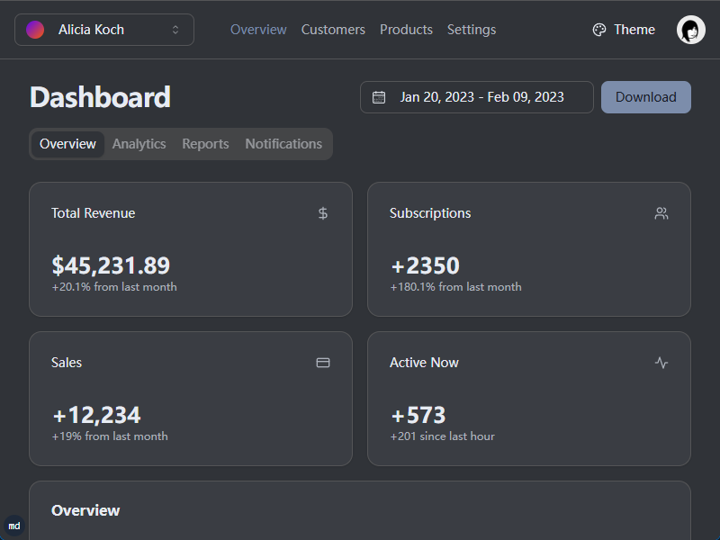

# Tauri UI Template

A desktop app starter built with Tauri, React, TypeScript, Vite, and shadcn/ui. It ships with a ready-to-use dashboard, a routed frontend structure, and a modern toolchain for building cross-platform desktop products.



## Features

- Cross-platform desktop packaging with [Tauri](https://tauri.app/) for Windows, macOS, and Linux
- React 19 + TypeScript frontend powered by [Vite](https://vitejs.dev/)
- UI primitives from [shadcn/ui](https://ui.shadcn.com/) and [Radix UI](https://www.radix-ui.com/)
- File-based routing with [TanStack Router](https://tanstack.com/router)
- Built-in dashboard pages and reusable UI components
- Theme support with light and dark modes
- Preconfigured developer tooling with Biome, Husky, Vitest, and Cargo
- Utility scripts for dependency maintenance and icon generation

## Quick Start

### 1. Clone the repository

```bash
git clone https://github.com/your-username/tauri-ui-template.git
cd tauri-ui-template
```

### 2. Install dependencies

```bash
pnpm install
```

### 3. Start development

```bash
# Start the Vite frontend
pnpm dev

# Start the Tauri desktop shell
pnpm td
```

### 4. Build the app

```bash
# Build the frontend bundle
pnpm build

# Build the desktop application
pnpm tb
```

## Scripts

| Command | Description |
| --- | --- |
| `pnpm dev` | Start the Vite development server |
| `pnpm build` | Build the frontend bundle |
| `pnpm preview` | Preview the production frontend build |
| `pnpm td` | Run Tauri in development mode |
| `pnpm tb` | Build the Tauri desktop app |
| `pnpm lint` | Run Biome checks and `cargo check` |
| `pnpm format` | Format frontend and Rust code |
| `pnpm test` | Run Vitest |
| `pnpm shadcn` | Add shadcn/ui components |
| `pnpm icon` | Generate multi-size app icons from `app-icon.png` |
| `pnpm taze` | Upgrade frontend dependencies |
| `pnpm cargo-update` | Upgrade Rust dependencies |
| `pnpm bump` | Run frontend, Rust, and shadcn updates together |
| `pnpm clean` | Remove frontend build artifacts and Cargo output |

## Tech Stack

- Framework: Tauri + Vite
- Frontend: React 19 + TypeScript
- Routing: TanStack Router
- UI: shadcn/ui + Radix UI + Tailwind CSS v4
- Testing: Vitest
- Formatting and linting: Biome
- Package manager: pnpm
- Native backend: Rust

## Project Structure

```text
tauri-ui-template/
├── public/              # Static assets
├── scripts/             # Utility scripts
├── src/                 # React application
│   ├── components/      # Shared UI and app components
│   ├── dashboard/       # Dashboard layouts and feature blocks
│   ├── lib/             # Utilities and helpers
│   ├── routes/          # File-based route entries
│   └── styles/          # Global styles
├── src-tauri/           # Tauri and Rust source
│   ├── capabilities/    # Tauri capability config
│   ├── icons/           # Generated app icons
│   └── src/             # Rust entry points
└── images/              # Repository images
```

## Development Notes

### Add a page

Create a new route file inside `src/routes/`. The TanStack Router plugin will generate the route tree during development and build.

### Add a UI component

```bash
pnpm shadcn add button
```

You can also copy and adapt components directly from the shadcn/ui catalog if you want tighter control over implementation details.

### Customize theming

Theme handling lives in `src/components/theme-provider.tsx`, and the color tokens are defined in `src/styles/globals.css`.

### Update dependencies

```bash
pnpm taze
pnpm cargo-update
pnpm bump
```

## License

MIT
