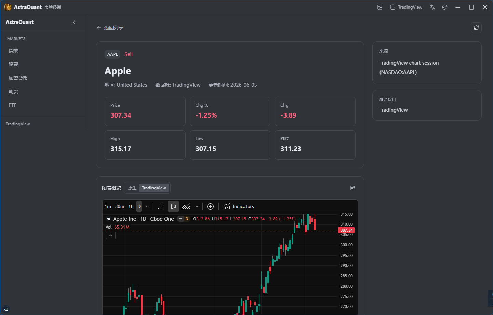
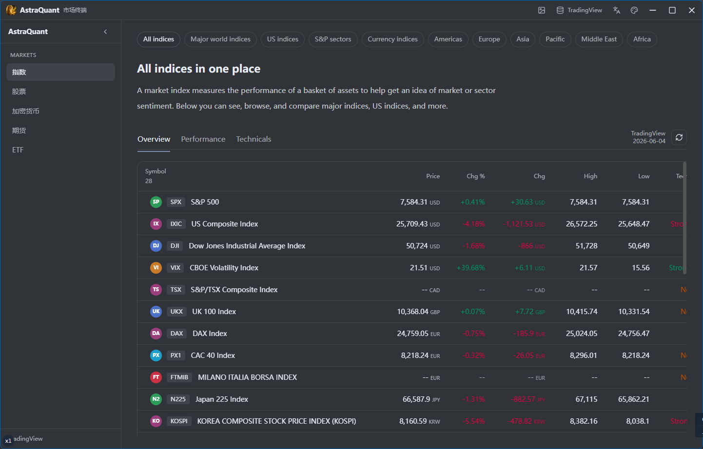

# AstraQuant

Desktop market intelligence, rebuilt for speed.

AstraQuant is a cross-platform trading and market-monitoring terminal built with Tauri, React, TypeScript, and Rust. It is designed for fast scanning, multi-asset navigation, provider switching, and chart-centric workflows without the weight of a browser-only stack.

## Why AstraQuant

Most market tools either feel like a web page stretched into a desktop window or a legacy terminal frozen in time. AstraQuant aims for a middle ground:

- fast desktop delivery with a native shell
- a modern, data-dense interface for active market observation
- flexible provider routing for different asset views
- a clean base for deeper charting, research, and execution workflows

## Demo

Overview screen with market sections, watchlist-style navigation, and a dense terminal layout:



Detail workspace with price context, instrument stats, and integrated chart views:



## Highlights

- Multi-asset market views covering indices, stocks, crypto, futures, and ETFs
- Provider switching with support for aggregated market data and TradingView-driven flows
- Detail pages with snapshot metrics, native chart rendering, and TradingView advanced chart integration
- Desktop packaging with [Tauri](https://tauri.app/) for Windows, macOS, and Linux
- React 19 + TypeScript frontend powered by [Vite](https://vitejs.dev/)
- UI foundations built with [shadcn/ui](https://ui.shadcn.com/), [Radix UI](https://www.radix-ui.com/), and Tailwind CSS v4
- File-based routing via [TanStack Router](https://tanstack.com/router)
- Multiple theme modes, including light, dark, dim, ocean, and avocado
- Development tooling with Biome, Husky, Vitest, and Cargo

## Quick Start

### 1. Clone the repository

```bash
git clone https://github.com/Super1WindCloud/astraquant.git
cd astraquant
```

### 2. Install dependencies

```bash
pnpm install
```

### 3. Start development

```bash
# Start the Vite frontend
pnpm dev

# Start the Tauri desktop shell
pnpm td
```

### 4. Build the app

```bash
# Build the frontend bundle
pnpm build

# Build the desktop application
pnpm tb
```

## Scripts

| Command             | Description                                       |
| ------------------- | ------------------------------------------------- |
| `pnpm dev`          | Start the Vite development server                 |
| `pnpm build`        | Build the frontend bundle                         |
| `pnpm preview`      | Preview the production frontend build             |
| `pnpm td`           | Run Tauri in development mode                     |
| `pnpm tb`           | Build the Tauri desktop app                       |
| `pnpm lint`         | Run Biome checks and `cargo check`                |
| `pnpm format`       | Format frontend and Rust code                     |
| `pnpm test`         | Run Vitest                                        |
| `pnpm shadcn`       | Add shadcn/ui components                          |
| `pnpm icon`         | Generate multi-size app icons from `app-icon.png` |
| `pnpm taze`         | Upgrade frontend dependencies                     |
| `pnpm cargo-update` | Upgrade Rust dependencies                         |
| `pnpm bump`         | Run frontend, Rust, and shadcn updates together   |
| `pnpm clean`        | Remove frontend build artifacts and Cargo output  |

## Tech Stack

- Framework: Tauri + Vite
- Frontend: React 19 + TypeScript
- Routing: TanStack Router
- UI: shadcn/ui + Radix UI + Tailwind CSS v4
- Charts: Lightweight Charts + TradingView embed
- Testing: Vitest
- Formatting and linting: Biome
- Package manager: pnpm
- Native backend: Rust

## Project Structure

```text
astraquant/
├── public/              # Static assets
├── scripts/             # Utility scripts and TradingView bridge helpers
├── src/                 # React application
│   ├── components/      # Shared UI and market components
│   ├── dashboard/       # Dashboard layouts and feature blocks
│   ├── lib/             # Utilities, i18n, and market metadata
│   ├── routes/          # File-based route entries
│   └── styles/          # Global styles
├── src-tauri/           # Tauri and Rust source
│   ├── capabilities/    # Tauri capability config
│   ├── icons/           # Generated app icons
│   └── src/             # Native commands and market data services
└── images/              # README demo images
```

## Development Notes

### Add a page

Create a new route file inside `src/routes/`. The TanStack Router plugin generates the route tree during development and build.

### Add a UI component

```bash
pnpm shadcn add button
```

You can also copy and adapt components directly from the shadcn/ui catalog when tighter control is more useful than scaffolding.

### Customize theming

Theme handling lives in `src/components/theme-provider.tsx`, and the design tokens are defined in `src/styles/globals.css`.

### Update dependencies

```bash
pnpm taze
pnpm cargo-update
pnpm bump
```

## License

MIT
